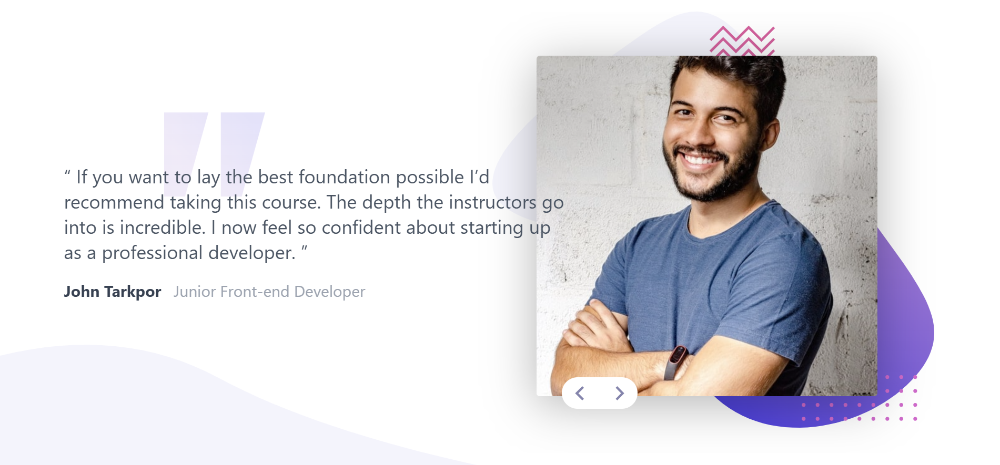
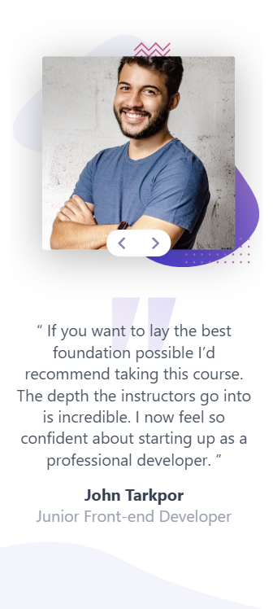
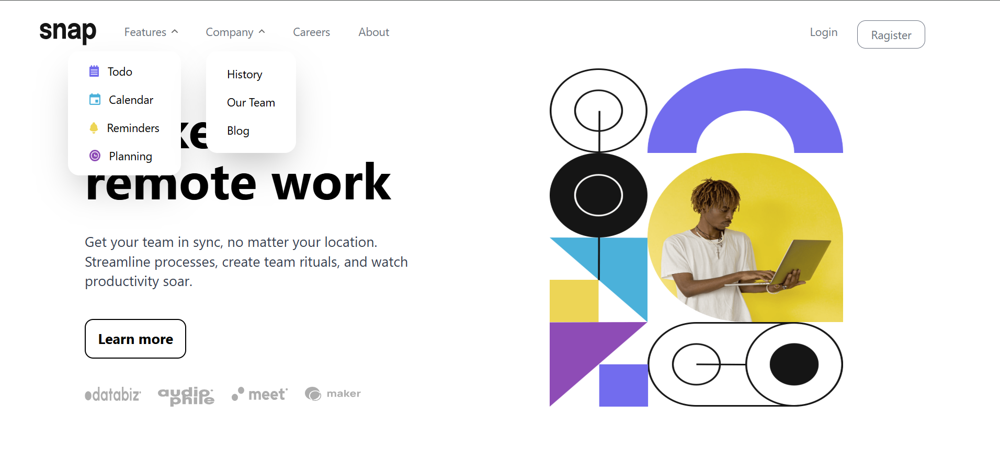
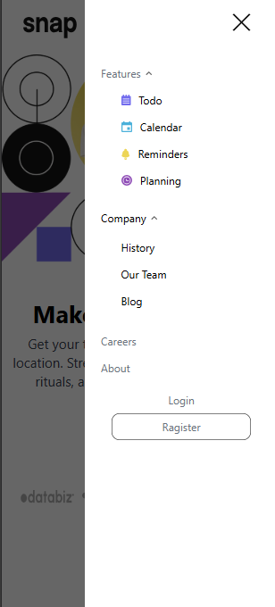

### Challenges and Progress
### Overview
These challenges were part of my journey to improve my frontend development skills. I worked on various UI components, interactive features, and layout designs to strengthen my understanding of HTML, CSS, JavaScript, React, and other web technologies.

### 1-coding-bootcamp-testimonials-slider-master

### 2-intro-section-with-dropdown-navigation-main

