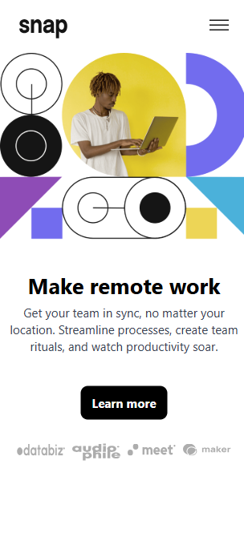

Challenges and Progress
# Overview
These challenges were part of my journey to improve my frontend development skills. I worked on various UI components, interactive features, and layout designs to strengthen my understanding of HTML, CSS, JavaScript, React, and other web technologies.

# 1-coding-bootcamp-testimonials-slider-master

# 2-intro-section-with-dropdown-navigation-main

# 3- fylo-dark-theme-landing-page-master

# 4- project-tracking-intro-component-master

# 5-pricing-component-with-toggle-master

# 6-insure-landing-page-master

# 7-social-media-dashboard-with-theme-switcher-master

