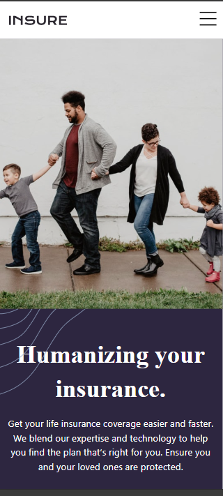

# Responsive Insure Landing Page

This project is a responsive landing page for "Insure," built with React and Tailwind CSS. The design emphasizes accessibility, modern animations, and responsiveness to create a user-friendly experience.

## ScreenShot


## Features

- **Fully Responsive Design**: Adapts seamlessly to various screen sizes (mobile, desktop).
- **Accessible Navigation**: Includes keyboard and screen reader support for all interactive elements.
- **Smooth Animations**:
  - Buttons and links have hover effects and transitions.
  - Menu opens with sliding and fading animations.
- **Modern Styling**: Designed with Tailwind CSS for flexibility and simplicity.

## Live Preview

[View Live Demo](#)

## Technologies Used

- **React**: Component-based UI framework.
- **Tailwind CSS**: Utility-first CSS framework for styling.
- **HTML & CSS**: Basic markup and styles.

## Installation

1. **Clone the repository:**
   ```bash
   git clone https://github.com/khaduj03/Frontend-Mentor-challenges-part2.git
   ```
2. **Navigate to the project folder:**
   ```bash
   cd insure-landing-page-master
   ```
3. **Install dependencies:**
   ```bash
   npm install
   ```
4. **Start the development server:**
   ```bash
   npm start
   ```

## Project Structure

```plaintext
src/
├── components/
│   ├── Header.jsx      # Navigation bar with dropdown menu
│   ├── HeroSection.jsx # Main hero section with a call to action
│   ├── Features.jsx    # Features section highlighting the company's offerings
│   ├── Footer.jsx      # Footer with social links and navigation
├── assets/             # Images, icons, and other static assets
├── App.jsx             # Root component
├── index.js            # Entry point
```

## Accessibility Features

- **ARIA Labels**: Used for buttons, links, and interactive elements.
- **Keyboard Navigation**: All components are navigable using the keyboard.
- **Screen Reader Support**: Semantic HTML and ARIA attributes enhance screen reader usability.

## Animations

### Buttons
- Hover effects with smooth transitions for scale, shadow, and background color.

### Dropdown Menu
- Sliding and fading animations for opening and closing the mobile menu.

### Social Icons
- Hover effects with scale and opacity transitions.

## Contributing

Contributions are welcome! Follow these steps to contribute:

1. Fork the repository.
2. Create a new branch: `git checkout -b feature/your-feature-name`
3. Commit your changes: `git commit -m 'Add some feature'`
4. Push to the branch: `git push origin feature/your-feature-name`
5. Open a pull request.


## Acknowledgments

- [Frontend Mentor](https://www.frontendmentor.io) for providing the design challenge.
- [React Documentation](https://reactjs.org/docs/getting-started.html)
- [Tailwind CSS Documentation](https://tailwindcss.com/docs/installation)

---

Enjoy working with this project! If you have any questions or feedback, feel free to open an issue.

