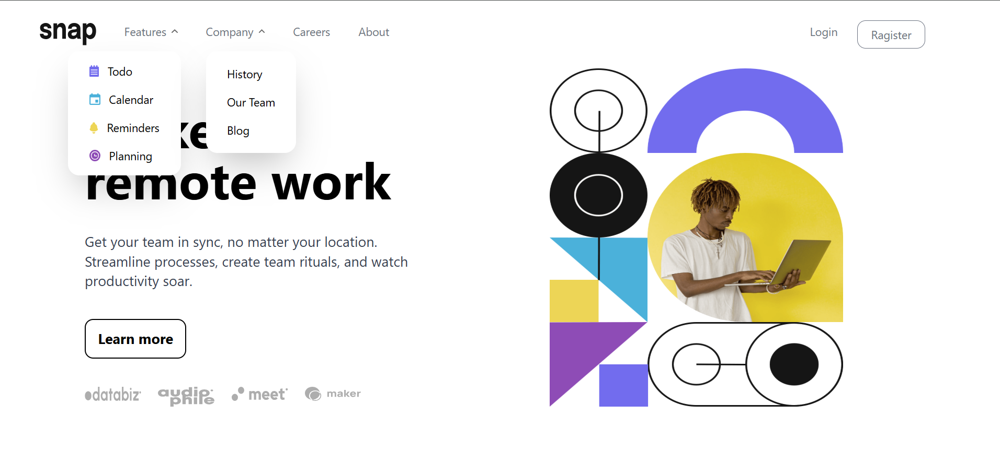

### Remote Work Web Application
### Overview
    This is a responsive web application designed to help teams work remotely. It includes a modern, user-friendly interface that adapts to both desktop and mobile screens. The app includes a landing page with a hero section, a navigation bar, and various interactive elements such as dropdown menus and animations. It is built using React and styled with Tailwind CSS, and also incorporates Framer Motion for smooth animations.


### Screenshots
In this section, you can view screenshots of the app that showcase its design and functionality across various pages.



### Features
    Hero Section: A visually appealing header that welcomes users and explains the core value of remote work.
    Responsive Design: The layout adapts to different screen sizes, with a mobile-friendly navigation bar and responsive images.
    Dynamic Dropdown Menus: Menus for "Features" and "Company" sections with smooth animation effects.
    Interactive Animations: Hover effects and transitions on navigation items, buttons, and menu items using Framer Motion.
    Login and Register Buttons: Styled buttons with hover effects that redirect users to respective pages.
### Technologies Used
    React: A JavaScript library for building user interfaces.
    Tailwind CSS: A utility-first CSS framework used for styling the application.
    Framer Motion: A popular library for animations in React applications.


To get started with this project, follow the steps below:
### Prerequisites
Ensure you have the following software installed:

    Node.js (version >= 12.0)
    npm or yarn for package management
    Steps to Run the Application Locally
    Clone the Repository:

git clone https://github.com/khaduj03/Frontend-Mentor-challenges-part2.git

Navigate into the project folder:
cd coding-bootcamp-testimonials-slider-master
Install Dependencies: Use npm or yarn to install the required dependencies.

npm install
Start the Application: To run the app locally, use the following command:
npm start


This will start the application in development mode and open it in your default browser. The app will automatically reload if you make changes to any of the source files.

### How It Works
Components
    App.js: This is the root component where the main layout of the application is structured. It contains the hero section and main content.

    Header.js: A component that renders the navigation bar and handles the mobile menu toggle.

    Menu.js: A dropdown menu component that manages the "Features" and "Company" sections with dynamic visibility and animations.

### CSS Styling:
    The app uses Tailwind CSS for fast and responsive styling. It includes custom classes to handle responsive layouts and design adjustments.
### Key Features in Code
    Responsive Flex Layout: Using flex, lg:flex-row, and lg:flex-col-reverse, the layout adapts to different screen sizes.

    Framer Motion Animations: Smooth sliding and fade-in animations for the menu, dropdowns, and other interactive elements.

    Mobile Menu: On smaller screens, a hamburger menu is displayed, which toggles the visibility of the navigation links.

    Hover Effects: Interactive hover effects for navigation items and buttons using Tailwind CSS and Framer Motion.

### Example of Code Snippet for Animations:
In Menu.js, hover animations are implemented using motion.li and whileHover:

    ```
    <motion.li
    className="flex cursor-pointer"
    whileHover={{
        scale: 1.1,
        boxShadow: "0 10px 30px rgba(0, 0, 0, 0.1)",
        opacity: 0.9,
        y: -5,
        transition: { duration: 0.3 },
    }}
    >
    <span className="mt-1 mr-3">
        
    </span>{" "}
    Todo
    </motion.li>
    ```
### Example of Code Snippet for Menu Toggle:
In Header.js, the mobile menu toggle functionality is managed using React's useState:
    ```
    const [toggle, setToggle] = useState(false);

    const handleMenu = () => {
    setToggle(!toggle);
    };

    return (
    <div className="w-screen h-14 flex justify-between p-8">
        <div className="lg:hidden">
        <button onClick={handleMenu}>
            
        </button>
        </div>
        {toggle && (
        <motion.div
            initial={{ x: "100%" }}
            animate={{ x: toggle ? 0 : "100%" }}
            exit={{ x: "100%" }}
            transition={{ type: "spring", stiffness: 250, damping: 30 }}
            className="fixed top-0 right-0 w-72 h-screen bg-white"
        >
            <button className="w-full h-16 flex p-10 justify-end items-center" onClick={handleMenu}>
            
            </button>
            <nav className="p-6 space-y-4">
            <Menu />
            </nav>
        </motion.div>
        )}
    </div>
    );
    ```
### Contributions
Feel free to fork this repository and contribute by opening a pull request. Here's how you can contribute:
Fork the project.
Clone your forked repository:

git clone https://github.com/khaduj03/Frontend-Mentor-challenges-part2.git
-Create a new branch:
-git checkout -b feature-name
-Make your changes and commit them:
-git commit -m "Add a new feature"
-Push your changes to your forked repository:
-git push origin feature-name
-Open a pull request to the main repository.


