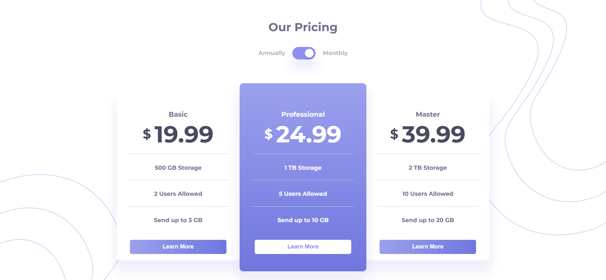

# Pricing Page

This project is a pricing page that allows users to toggle between "Monthly" and "Annually" pricing plans. The page is designed with accessibility in mind and includes smooth animations when switching between the pricing options.
## ScreenShot


## Features
- Toggle between "Monthly" and "Annually" pricing.
- Accessible for screen readers and keyboard navigation.
- Responsive design using custom styles and fonts.

## Technologies Used
- **HTML** for structure.
- **CSS** for styling and transitions.
- **JavaScript** for interactivity and DOM manipulation.
- **Google Fonts** (Montserrat) for typography.

## Setup Instructions

1. Clone the repository to your local machine:
   ```bash
   git clone https://github.com/khaduj03/Frontend-Mentor-challenges-part2.git
   ```
2. cd pricing-component-with-toggle-master


## Setup Instructions

- **Open the `index.html` file in your browser to view the page.**
- If you wish to modify the styles, **open the `styles/style.css` file.**
- If you wish to modify the functionality, **the JavaScript is in the `script.js` file.**

## How It Works

- **Toggle Switch**: Click the toggle button to switch between the "Annually" and "Monthly" prices.
- **Accessibility**: The page includes accessibility features like ARIA attributes and keyboard navigation.

## Contributing

Feel free to fork the repository and make improvements. If you find any bugs or have suggestions, please open an issue or create a pull request.

