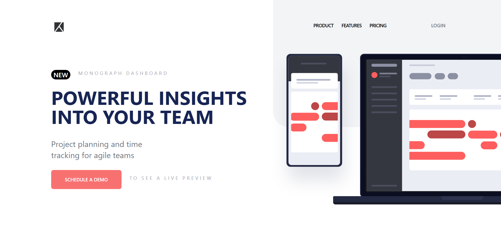

# Frontend Mentor Challenge

This project is a solution to a Frontend Mentor challenge. It consists of three main components:
- **Header**: Displays the navigation bar and logo.
- **Main**: Showcases the main content area, including an introduction and call-to-action.
- **Footer**: Provides attribution and external links.

# ScreenShot




## Features

- **Responsive Design**: The application is fully responsive and adapts to different screen sizes.
- **Accessibility**: Semantic HTML and ARIA attributes ensure accessibility for users with assistive technologies.
- **Component-Based Architecture**: The application is divided into reusable components for easier management and scalability.

---

## Project Structure

```plaintext
src/
├── components/
│   ├── Footer.js
│   ├── Header.js
│   ├── Main.js
├── App.js
├── index.js
├── styles.css
```

### Components
- **Header**:
  - Contains navigation links with hover animations.
  - Includes a toggleable mobile menu using Framer Motion.
- **Main**:
  - Highlights product features and a call-to-action button.
  - Includes an illustration with background elements.
- **Footer**:
  - Provides attribution to Frontend Mentor and the developer profile.

---

## Accessibility Enhancements

1. **Semantic HTML**: Proper use of `<header>`, `<main>`, and `<footer>` tags.
2. **ARIA Attributes**:
   - `aria-label` for descriptive labels on links and buttons.
   - `role="dialog"` for mobile menu with `aria-modal="true"`.
3. **Keyboard Navigation**: All interactive elements are keyboard-accessible.
4. **Alt Text**: Images include descriptive alt text.
5. **Focus Management**: Ensures proper focus flow across components.

---

## Technologies Used

- **React**: Component-based library for building the user interface.
- **Tailwind CSS**: Utility-first framework for styling.
- **Framer Motion**: Animations and transitions.

---

## Setup Instructions

1. Clone the repository:
   ```bash
   git clone https://github.com/khaduj03/Frontend-Mentor-challenges-part2.git
   ```

2. Navigate to the project directory:
   ```bash
   cd project-tracking-intro-component-master
   ```

3. Install dependencies:
   ```bash
   npm install
   ```

4. Start the development server:
   ```bash
   npm start
   ```

5. Open the application in your browser at:
   ```
   http://localhost:3000
   ```

---


## Acknowledgments

- Challenge by [Frontend Mentor](https://www.frontendmentor.io?ref=challenge).
- Developed by [Khaduj](https://www.frontendmentor.io/profile/khaduj03).

---

## License

This project is licensed under the MIT License. You are free to use, modify, and distribute the code.

