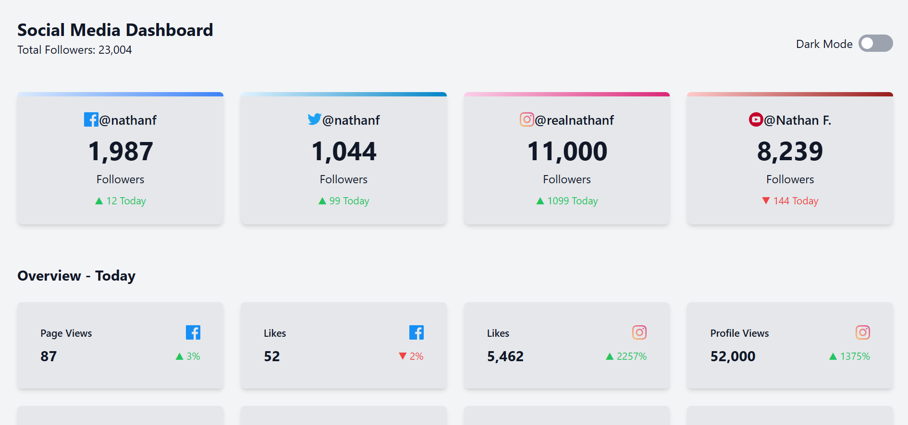
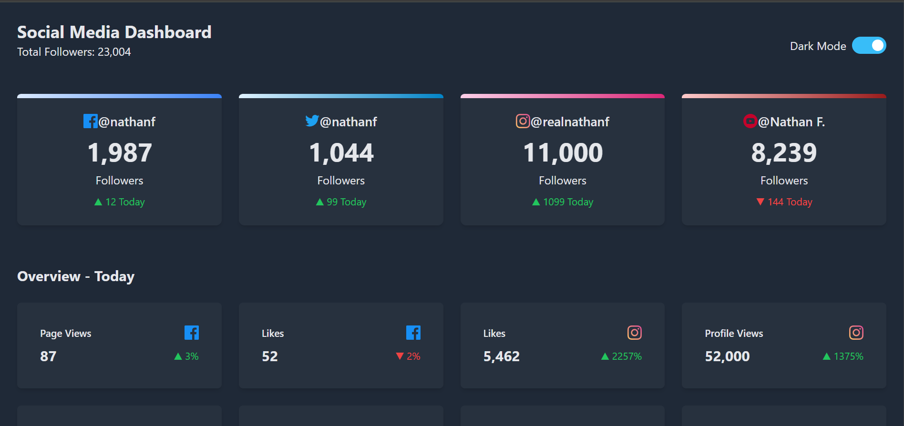

# Social Media Dashboard

## Overview

This project is a Social Media Dashboard built with React and Framer Motion. It features a dark mode toggle, responsive design, and dynamic cards showcasing statistics and insights for various social media platforms.

---

## Screenshots

### Dashboard (Light Mode)



### Dashboard (Dark Mode)



## Features

- **Dark Mode**: Easily toggle between light and dark themes for a seamless user experience.
- **Responsive Design**: Adaptable to various screen sizes, ensuring accessibility on mobile, tablet, and desktop devices.
- **Interactive Animations**: Leveraging Framer Motion for smooth transitions and hover effects.
- **Dynamic Data Rendering**: Social media data (followers, likes, views, etc.) is displayed dynamically using React props.
- **Accessibility Enhancements**: Semantic HTML, ARIA roles, and keyboard navigation support.

---

## Technologies Used

- **React**: For component-based architecture and state management.
- **Tailwind CSS**: For a utility-first CSS framework, enabling rapid UI development.
- **Framer Motion**: For animations and interactive visual effects.

---

## Project Structure

```
|-- src
   |-- Components
       |-- Card
           |-- Card.js
           |-- import.js
       |-- DashboardHeader.js
       |-- OverviewCard.js
   |-- App.js
|-- public
|-- assets
   |-- images
```

---

## Components

### 1. **Card**
   Displays individual social media platform data such as followers, username, and daily statistics.

   - Props:
     - `platform`: Social media platform name.
     - `username`: User’s handle.
     - `count`: Total followers.
     - `todayCount`: Daily follower change.
     - `Icon`: Platform-specific icon.
     - `color`: Gradient color for the header.
     - `isNegative`: Boolean indicating if the daily change is negative.

### 2. **DashboardHeader**
   Displays the total followers and a toggle button for dark mode.

   - Props:
     - `totalFollowers`: Total number of followers across all platforms.
     - `toggleDarkMode`: Function to toggle between light and dark mode.
     - `isDarkMode`: Boolean indicating the current theme state.
     - `setIsDarkMode`: State setter function for dark mode.

### 3. **OverviewCard**
   Displays daily performance metrics such as likes and views.

   - Props:
     - `title`: Metric name (e.g., "Likes").
     - `platform`: Platform name.
     - `value`: Metric value.
     - `percentage`: Change percentage.
     - `Icon`: Platform-specific icon.
     - `isNegative`: Boolean indicating if the percentage change is negative.

---

## Setup Instructions

1. Clone the repository:
   ```bash
   git clone https://github.com/khaduj03/Frontend-Mentor-challenges-part2.git
   ```

2. Navigate to the project directory:
   ```bash
   cd social-media-dashboard-with-theme-switcher-master
   ```

3. Install dependencies:
   ```bash
   npm install
   ```

4. Start the development server:
   ```bash
   npm start
   ```

5. Open the application in your browser at:
   ```
   http://localhost:3000
   ```

---


---

## Acknowledgments

- Icons sourced from [Frontend Mentor Assets](https://www.frontendmentor.io/).
- Animations powered by [Framer Motion](https://www.framer.com/motion/).
- UI styled using [Tailwind CSS](https://tailwindcss.com/).

---

## License

This project is licensed under the MIT License. Feel free to use, modify, and distribute the code.

---

## Contact

- Developed by [khaduj](https://github.com/your-profile).
- For inquiries, reach out to [khadijawakili268@gmail.com](khadijawakili268@gmail.com).

